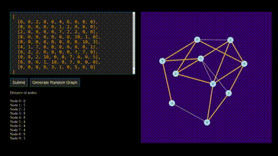

# PathFinder: Visual Journey Through Shortest Paths 🛣️

[](https://opensource.org/licenses/MIT)
[](https://www.docker.com/)
[](https://isocpp.org/)
[](https://reactjs.org/)

PathPilot is a powerful shortest path visualization toolkit featuring a C++ backend for efficient pathfinding algorithms and a React frontend for smooth, interactive visualizations. The project consists of two independent docker-containerized applications: GridGuide and StreetSage.


## 🎯 Projects

### 1. GridGuide
An interactive Dijkstra's algorithm visualizer with a performant C++ backend and responsive React frontend.



**Key Features:**
- High-performance C++ implementation of Dijkstra's algorithm
- Real-time visualization using React
- Interactive node placement and wall creation
- Microsecond-level path computation
- WebSocket-based communication between frontend and backend

[Watch GridGuide Demo Video](./assets/Grid.mp4)

### 2. StreetSage
A real-world pathfinding implementation using OpenStreetMap data, powered by C++ routing engine.


**Key Features:**
- OpenStreetMap integration
- C++ routing engine for lightning-fast calculations
- React-based interactive map interface
- Real-time routing updates
- Custom waypoint system

[Watch StreetSage Demo Video](./assets/StreetSage.mp4)

## 🚀 Prerequisites
- Docker >= 20.10.0
- Docker Compose >= 2.0.0

That's it! Everything else is containerized.

## 🛠️ Quick Start

### 1. Clone the repository
```bash
git clone https://github.com/vishalkishore/PathFinder
cd PathPilot
```

### 2. Start GridGuide
```bash
cd GridGuide
docker compose up
```
Access the application at `http://localhost`

### 3. Start StreetSage
```bash
cd StreetSage
docker compose up
```
Access the application at `http://localhost:5173`

## 🔧 Development Setup

### Running in Development Mode
GridGuide:
```bash
cd GridGuide
docker compose up --build
```

StreetSage:
```bash
cd StreetSage
docker compose up --build
```

## 🏗️ Build and Deployment

### Production Build
```bash
# Build and run GridGuide
cd GridGuide
docker compose up --build

# Build and run StreetSage
cd StreetSage
docker compose up --build
```

### Performance Optimization
- C++ backend is compiled with `-O3` optimization
- React frontend is bundled with production optimizations
- Docker images are multi-stage builds for minimal size

## 🤝 Contributing
1. Fork the repository
2. Create your feature branch (`git checkout -b feature/AmazingFeature`)
3. Commit your changes (`git commit -m 'Add some AmazingFeature'`)
4. Push to the branch (`git push origin feature/AmazingFeature`)
5. Open a Pull Request

## 🐛 Common Issues & Solutions

1. **Docker Build Errors**
   ```bash
   # Clean docker cache
   docker system prune -a
   # Rebuild with no cache
   docker compose build --no-cache
   ```

## 📜 License
This project is licensed under the MIT License - see the [LICENSE](LICENSE) file for details.

## 🙏 Acknowledgments
- OpenStreetMap contributors
- C++ Boost Graph Library
- React ecosystem contributors
- [https://github.com/honzaap/Pathfinding](Honzapp - Pathfinding)

---
⭐️ If you found this project helpful, please consider giving it a star!
